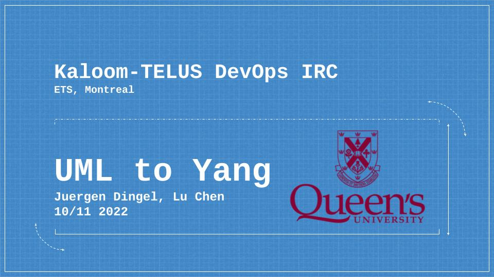

# From UML to Yang

## About:

### This is an undergraduate thesis project; we are building a translation tool that maps the UML to Yang language for Telus; many works in this field are sill unexplored, which means part of this project is also for exploration propose, the main goal is to find out the limitation of translating UML to Yang, and sumarize any engineering problem into paper.

 

# Postscript

## You can find more details from this persentation

